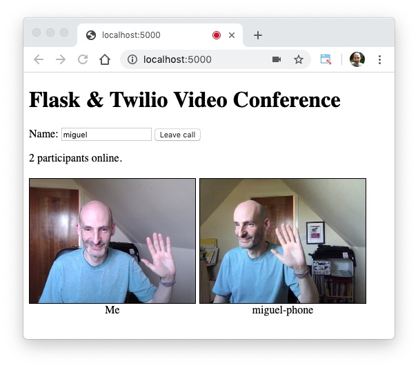

# flask-twilio-video

This is a simple web-based video conferencing application using Flask and Twilio Programmable Video.

## Installation Instructions

To install the application on your system follow these steps:

1. [Create a Twilio account](www.twilio.com/referral/7fB3Je) (if you don't have one yet). It's free!
2. [Generate an API Key](https://www.twilio.com/console/project/api-keys) for your account.
3. Clone this repository
4. Create a virtualenv and install the requirements
5. Create a *.env* file by copying the *.env.template* file. Fill out the values for your Twilio account's SID, API Key SID and API Key Secret.
6. Execute `python app.py` to start the server.
7. Navigate to *http://localhost:5000* on your web browser (or use your system's public IP address to connect from another computer or phone).
